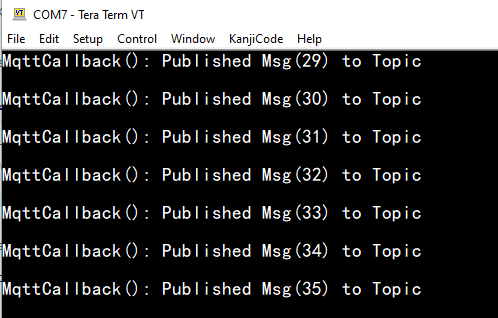

# Paho MQTT TLS Client for Ali Cloud

This example application acts as a Paho MQTT Client to connect to Secured MQTT Broker (Ali Cloud) and publishes and subscribes to data on subtopics.

## Description

This application demonstrates how a user can use the Paho MQTT Client to connect to a Secured MQTT Broker (Ali Cloud). The application shall come up in AP Provisioing mode, and user will need to configure the Wi-Fi credentials for the Home AP. The default application will try to establish MQTT TLS connection with “ProductKey”.iot-as-mqtt.cn-shanghai.aliyuncs.com and publishes message to a topic every 30 sec.

## Downloading and building the application

To download or clone this application from Github, go to the [top level of the repository](https://github.com/LeoZhang-ATMEL/PIC32MZ-W1-IOT-ALI)

To build the application, refer to the following table and open the project using its IDE.

| Project Name      | Description                                    |
| ----------------- | ---------------------------------------------- |
| pic32mz_w1_curiosity.X | MPLABX project for PIC32MZ W1 Curiosity Board |
|||

## Setting up PIC32MZ W1 Curiosity Board

- Connect the Debug USB port on the board to the computer using a micro USB cable
- On the GPIO Header (J207), connect U1RX (PIN 13) and U1TX (PIN 23) to TX and RX pin of any USB to UART converter
- Home AP (Wi-Fi Access Point with internet connection)

## Running the Application

1. Open the project
2. Currently MQTT Service is configured to run a MQTT Client in Secured mode to connect to 'PRODUCT-KEY'.iot-as-mqtt.cn-shanghai.aliyuncs.com on the mqtt secured port (1883). In case the user wants to change this config, please make the changes in the C Macro [`EXAMPLE_PRODUCT_KEY/EXAMPLE_DEVICE_NAME/EXAMPLE_DEVICE_SECRET` in the app.c](firmware/src/app.c#L78), and MQTT server address at [psMqttCfg->sBrokerConfig.brokerName](firmware/src/app.c#L285)

3. The WIFI credentials can be changed at source code at [configuration.h](firmware/src/config/pic32mz_w1_curiosity/configuration.h#L468) 
   It also can be changed after programmed. Provision the device using the following CLI Command "wifiprov set 0 1 "GEN" 0 1 3 "DEMO_AP" "password"" for Home AP with SSID DEMO_AP, and password as 'password'. More details on the CLI command can be found here.
 
4. Another way to change the WIFI credentials was through the Harmony 3 Configurator
 

5. Build and program the generated code into the hardware using its IDE
6. Open the Terminal application (Ex.:Tera term) on the computer
7. Connect to the "USB to UART" COM port and configure the serial settings as follows:
    - Baud : 115200
    - Data : 8 Bits
    - Parity : None
    - Stop : 1 Bit
    - Flow Control : None

8.	The Board will connect to Home AP and then as per the default MQTT Service configuration, it shall connect to 'PRODUCT-KEY'.iot-as-mqtt.cn-shanghai.aliyuncs.com and publish messages on the topic '/sys/PRODUC-TKEY/DEVICE-NAME/thing/event/property/post' periodically every 30 sec. It also subscribes to topic '/sys/PRODUC-TKEY/DEVICE-NAME/thing/service/property/set'
 

9. Login into the [Ali IoTStudio](https://iot.aliyun.com/), test the device connection.
10. Press button SW1 will trigger publish a MQTT package to update the button state. And the button state can be viewed at Ali IoTStudio Dashboard
 

11. Send *YellowLEDStatus* to the Device will turn on the Green LED on the board.

12. Now you are all set. On the next, you can launch Harmony3 configurator to add a new feature.
     The project was based on paho_mqtt_client example, add ATECC608 secure element driver and several PINs for the PIC32MZ W1 Curiosity Board.

Note: The secured tcp connection may require the user to modify WolfSSL component settings in MHC depending on the security settings of the site/ server he is trying to access.
